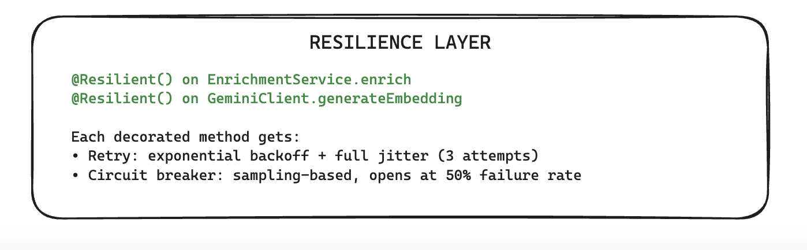

# Smart Semantic Bookmarking & Memory Engine

A production-grade micro-RAG pipeline that transforms raw text and URLs into searchable semantic memory. Ingest content → enrich with metadata → retrieve grounded answers in plain English.

---

## Quick Overview

Feed your bookmarks into the system. The pipeline:
1. **Enriches** them via LLM-powered metadata extraction (summary, tags, action items)
2. **Embeds** them into a 768-dimensional vector space for semantic search
3. **Retrieves** answers grounded exclusively in your saved content

No hallucinations. No keyword matching. Pure semantic understanding.

---

## System Architecture

This repository implements a resilient ingestion and retrieval pipeline utilizing **Gemini 2.5 Flash** for data enrichment and grounding, alongside **pgvector** for vector similarity search.

The system is organized into three core layers:

1. **Ingestion Loop** — Asynchronous bookmark processing with durability guarantees
2. **Retrieval Loop** — Sub-millisecond semantic search and context-grounded Q&A
3. **Resilience Layer** — Fault-tolerant patterns protecting LLM and database calls

---

## Architecture Layer 1: Ingestion Loop

Processes incoming bookmarks asynchronously, ensuring status tracking (`PENDING` → `PROCESSING` → `COMPLETED`/`FAILED`), extracts structured metadata via LLM, and generates vector embeddings.


### Execution Sequence

```
POST /api/v1/bookmarks
         ↓
[Initial Log: PENDING row written immediately]
         ↓
[Status Flip: PENDING → PROCESSING]
         ↓
[EnrichmentService @Resilient()]
  ├─ Gemini 2.5 Flash extracts: summary, tags, actionItems
         ↓
[GeminiClient.generateEmbedding @Resilient()]
  ├─ Vectorizes via gemini-embedding-001 → float[768]
         ↓
[Atomic Transaction]
  ├─ updateEnrichment → COMPLETED
  ├─ insertMany(todos) for generated actionItems
  └─ [On failure: FAILED state + errorMessage stored]
```

**Key Design**: A `PENDING` row is written **before any LLM call**. This means every ingestion attempt is durable from the start — a `FAILED` row carries the error; a stuck `PROCESSING` row indicates a crashed process.

---

## Architecture Layer 2: Retrieval Loop

Exposes semantic querying and context-grounded Retrieval-Augmented Generation (RAG) surfaces.


### Semantic Search (`GET /api/v1/search?q=...`)

```
Query: "how does broker scaling work"
         ↓
[Embed query via gemini-embedding-001]
         ↓
[pgvector cosine distance (HNSW index, top-3)]
  ├─ Sub-millisecond retrieval via pre-built index
         ↓
[Return: ranked BookmarkSelect[]]
```

The query `"how does broker scaling work"` semantically matches documents about Kafka partitioning — **no keyword overlap required**.

### Grounded Q&A (`POST /api/v1/ask`)

```
Question: "How does Kafka handle consumer scaling?"
         ↓
[Embed question via gemini-embedding-001]
         ↓
[pgvector cosine distance (HNSW index, top-3)]
         ↓
[Inject top-3 results as system context]
         ↓
[Gemini 2.5 Flash (grounded answer)]
         ↓
[Return: hallucination-resistant answer]
```

If no relevant bookmarks are found, the system responds: *"I don't have enough context in my bookmarks to answer this."*

---

## Architecture Layer 3: Resilience Layer

Protects downstream dependencies and LLM providers via robust fault-tolerant patterns.



### Decorators Applied

- `@Resilient()` on `EnrichmentService.enrich`
- `@Resilient()` on `GeminiClient.generateEmbedding`

### Policy Specifications

| Policy | Specification |
|--------|---------------|
| **Retry Strategy** | 3 attempts with exponential backoff + full jitter to disperse concurrent spikes |
| **Circuit Breaker** | Sampling-window monitoring; opens to `OPEN` state at 50% failure rate threshold, shedding local load |

Each decorated method is shielded against transient failures, network latency, and cascading downstream issues.

---

## Technology Stack

| Layer | Technology |
|-------|------------|
| **Runtime** | Node.js + TypeScript (NestJS) |
| **Vector DB** | PostgreSQL 16 + pgvector |
| **LLM** | Gemini 2.5 Flash (structured output + free-text) |
| **Embeddings** | gemini-embedding-001 (768 dimensions) |
| **Validation** | Zod (structured LLM output schema) |
| **ORM** | Drizzle ORM |
| **Resilience** | cockatiel (retry + circuit breaker) |

---

## Infrastructure Setup

**Prerequisites:** Docker, Node.js 20+

```bash
# 1. Clone and configure environment
git clone <repo>
cd smart-semantic-bookmarking-and-memory-engine
cp .env.example .env
# Fill in DB_PASSWORD and GEMINI_API_KEY in .env

# 2. Start the application
docker compose up -d --build
```

For local development without Docker:
```bash
npm install
npm run start:dev
```

**Swagger UI** is available at `http://localhost:3000/api/v1/docs`.

### Environment Variables

```env
DB_HOST=localhost
DB_PORT=5432
DB_USER=<postgres user>
DB_PASSWORD=<postgres password>
DB_NAME=bookmarks_db
DB_POOL_SIZE=10
SERVER_PORT=3000
GEMINI_API_KEY=<your key>
```

---

## API Reference

### Ingest a Bookmark

**Request:**
```http
POST /api/v1/bookmarks
Content-Type: application/json

{
  "rawText": "Kafka uses a partition-per-consumer model to achieve horizontal scale. Each partition is an ordered, immutable log."
}
```

**Response:**
```json
{
  "id": "d3f1a2b4-...",
  "originalUrl": "Kafka uses a partition-per-consumer model...",
  "contentSummary": "Kafka achieves horizontal scalability by assigning partitions to consumers, where each partition maintains an ordered, immutable log of messages.",
  "tags": ["kafka", "partitioning", "messaging", "distributed-systems", "scalability"],
  "status": "COMPLETED",
  "embedding": null,
  "errorMessage": null,
  "createdAt": "2026-05-27T10:00:00.000Z"
}
```

---

### Semantic Search

**Request:**
```http
GET /api/v1/search?q=how does broker scaling work
```

**Response:**
```json
[
  {
    "id": "d3f1a2b4-...",
    "originalUrl": "Kafka uses a partition-per-consumer model...",
    "contentSummary": "Kafka achieves horizontal scalability by assigning partitions to consumers, where each partition maintains an ordered, immutable log of messages.",
    "tags": ["kafka", "partitioning", "messaging", "distributed-systems", "scalability"],
    "status": "COMPLETED",
    "createdAt": "2026-05-27T10:00:00.000Z"
  }
]
```

---

### Ask Your Bookmarks (RAG)

**Request:**
```http
POST /api/v1/ask
Content-Type: application/json

{
  "question": "How does Kafka handle consumer scaling?"
}
```

**Response:**
```json
{
  "answer": "Based on your saved content: Kafka achieves consumer scaling through its partition model — each partition is assigned to exactly one consumer within a consumer group, allowing throughput to scale horizontally by adding partitions and consumers in tandem."
}
```

**No Context Response:**
```json
{
  "answer": "I don't have enough context in my bookmarks to answer this. Try ingesting relevant content first."
}
```

---

## Ingestion Status Lifecycle

```
PENDING ──────► PROCESSING ──────► COMPLETED
                            ╲
                             ──────► FAILED (errorMessage populated)
```

**Guarantee:** A `PENDING` row is written before any LLM call. Every ingestion attempt is durable from the start.

---

## Key Design Decisions

Design decision records live in `docs/decisions/`. Key highlights:

| ADR | Decision | Rationale |
|-----|----------|-----------|
| [003](docs/decisions/003-ai-client-abstraction.md) | Provider-agnostic `IAiClient` | Gemini is an implementation detail; swap providers without architecture changes |
| [006](docs/decisions/006-drizzle-transaction-propagation.md) | `DrizzleTransactionContext` via AsyncLocalStorage | Transactions propagate cleanly through async boundaries |
| [009](docs/decisions/009-semantic-search-query.md) | Cosine distance over L2 | Magnitude-invariant similarity for embeddings |
| [010](docs/decisions/010-rag-pipeline-design.md) | Context injected via system prompt, not user message | Prevents prompt injection; maintains semantic integrity |
| [011](docs/decisions/011-ingestion-state-machine.md) | `PENDING` written first | Failures are always observable; no silent losses |
| [012](docs/decisions/012-resilience-module.md) | `@Resilient()` decorator for retry + circuit breaker | Centralized fault tolerance; consistent policy application |

---

## Development

### Running Tests

```bash
npm run test
npm run test:e2e
```

### Building for Production

```bash
npm run build
npm run start:prod
```

---

## Contributing

1. Fork the repository
2. Create a feature branch: `git checkout -b feature/your-feature`
3. Commit changes: `git commit -am 'Add feature description'`
4. Push to branch: `git push origin feature/your-feature`
5. Submit a pull request

---