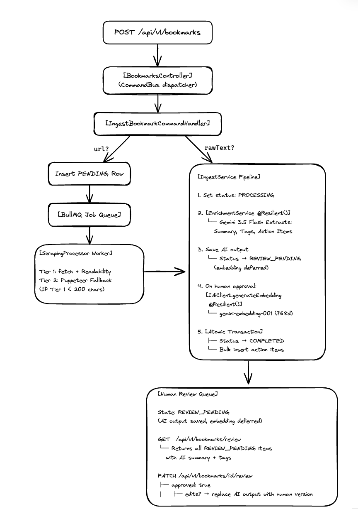
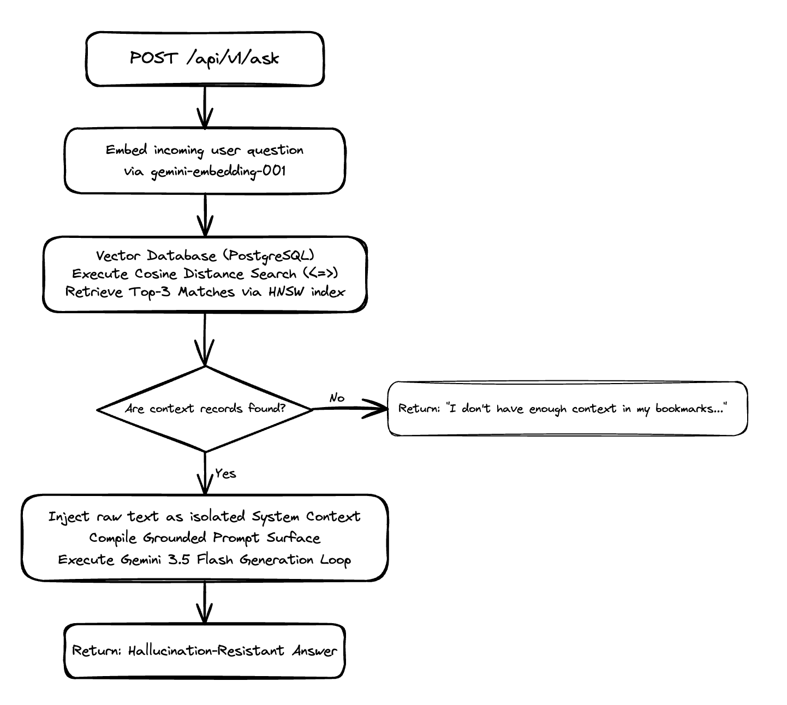
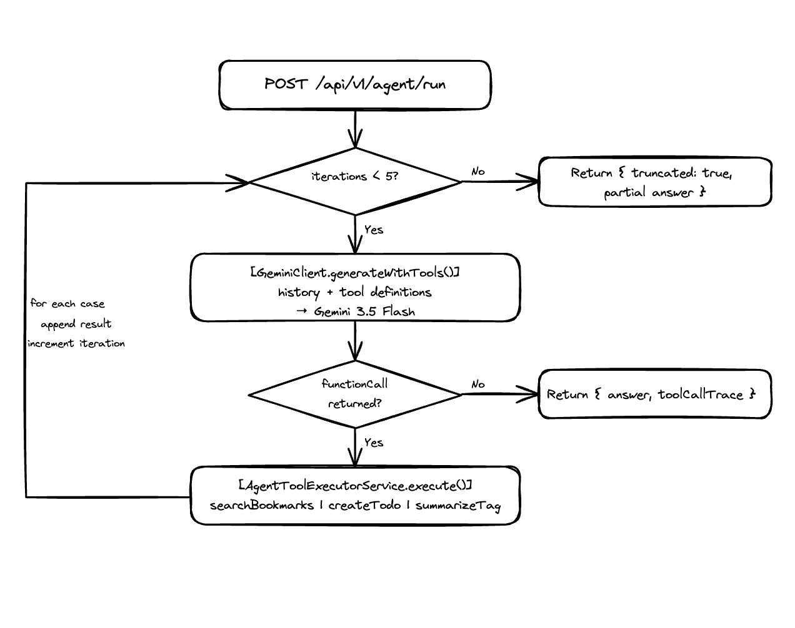
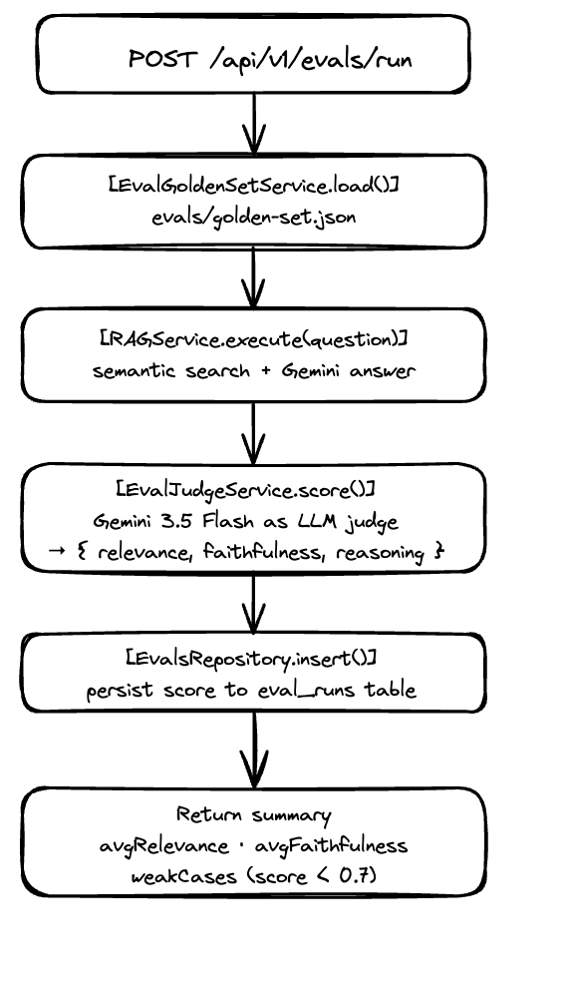
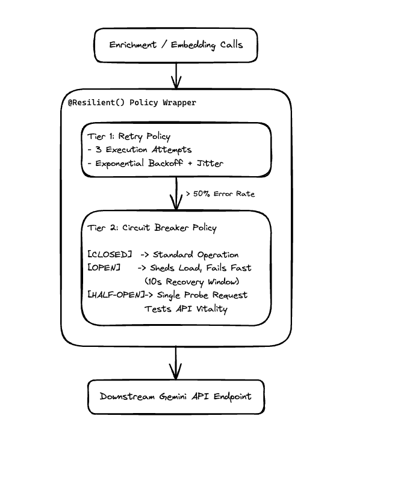

# Smart Semantic Bookmarking & Memory Engine

A production-grade micro-RAG pipeline that transforms raw text and URLs into searchable semantic memory. Feed in content — the system enriches it, embeds it, and lets you retrieve grounded answers in plain English.

No hallucinations. No keyword matching. Pure semantic understanding.

---

## What it does

1. **Accepts** raw text directly, or scrapes a URL asynchronously via a job queue
2. **Enriches** content using Gemini 3.5 Flash — extracting a summary, tags, and action items
3. **Reviews** AI output via a human-in-the-loop queue before embedding — corrections are stored as training signal
4. **Embeds** the content into a 768-dimensional vector space (pgvector)
5. **Retrieves** bookmarks via hybrid search (semantic + lexical, fused with RRF) and generates grounded answers, streamed or synchronous
6. **Acts** via an agent that uses Gemini native function calling to search, synthesise, and create todos in a multi-turn control loop
7. **Measures** answer quality automatically via an LLM-as-judge eval harness
8. **Tracks** token usage and cost per AI operation automatically, with zero bookkeeping in any calling service

---

## System Architecture

Four core layers: an ingestion pipeline with human review, a retrieval surface, an eval harness, and a resilience layer protecting all external calls.

---

### Layer 1 — Ingestion Loop

Accepts either raw text (synchronous) or a URL (async via BullMQ). Both paths converge at the same enrichment and embedding pipeline.



#### Tiered URL Scraping

`ScraperService` avoids launching a headless browser for every request:

| Tier         | Mechanism                        | When                                |
| ------------ | -------------------------------- | ----------------------------------- |
| **1 — Fast** | `fetch` + `@mozilla/readability` | Always attempted first              |
| **2 — Full** | Puppeteer (`networkidle2`)       | Only when Tier 1 yields < 200 chars |

Static pages (GitHub, documentation, blog posts) never touch Chrome. JavaScript-rendered SPAs fall back to Puppeteer automatically.

#### Ingestion State Machine

```
PENDING ──► PROCESSING ──► REVIEW_PENDING ──► COMPLETED
                       ╲                  ╲
                        ──► FAILED          ──► FAILED (HUMAN_REJECTED)
```

A `PENDING` row is written **before** any scraping or LLM call. Every attempt is observable from the start. Enrichment completes to `REVIEW_PENDING` — a human approves, edits, or rejects before embedding runs. Every AI-vs-human delta is stored in the `corrections` table as future fine-tuning signal.

#### Execution Sequence — rawText

```
POST /api/v1/bookmarks  { rawText: "..." }
  │
  ├─ Write PENDING row to DB
  ├─ Transition PENDING → PROCESSING
  ├─ EnrichmentService.enrich()  [@Resilient()]
  │    └─ Gemini 3.5 Flash → { contentSummary, tags, actionItems }
  ├─ IAiClient.generateEmbedding()  [@Resilient()]
  │    └─ gemini-embedding-001 → float[768]
  └─ Atomic transaction
       ├─ updateEnrichment → COMPLETED
       └─ insertMany(todos) linked to bookmark
```

#### Execution Sequence — URL

```
POST /api/v1/bookmarks  { url: "https://..." }
  │
  ├─ Write PENDING row to DB
  ├─ Enqueue BullMQ job  (jobId = bookmarkId, 3 retries, exponential backoff)
  └─ Return PENDING bookmark immediately  ← HTTP response ends here

  [async — BullMQ worker]
  ├─ ScraperService.scrape(url)
  │    ├─ Tier 1: fetch + Readability  (fast path)
  │    └─ Tier 2: Puppeteer            (JS-rendered fallback)
  └─ IngestService.processRawText()  → same enrichment pipeline as above
```

---

### Layer 2 — Retrieval Loop



#### Hybrid Search — `GET /api/v1/search?q=...`

Two retrievers run **concurrently**, then get fused:

- **Semantic** — the query is embedded via `gemini-embedding-001`, then a cosine distance query (`<=>`) runs against the pgvector HNSW index
- **Lexical** — Postgres full-text search (`tsvector`/`ts_rank`) against a `tsvContent` column kept in sync with every enrichment update

Results are merged with **Reciprocal Rank Fusion** (`score = Σ 1/(k + rank + 1)`, `k = 60`) rather than blending the two retrievers' raw scores — cosine distance and `ts_rank` live on incomparable scales, so RRF's rank-only approach avoids an arbitrary normalization step entirely (see [ADR-020](docs/decisions/020-hybrid-search-rrf-fusion.md)). Searching `"broker scaling"` surfaces a document about Kafka partitioning through the semantic side even with zero keyword overlap; an exact term or acronym gets caught by the lexical side even when its embedding neighbor isn't close.

#### Grounded Q&A — `POST /api/v1/ask` and `POST /api/v1/ask/stream`

The question is embedded and used to retrieve the top 3 relevant bookmarks via hybrid search. Those are injected as a system instruction into Gemini 3.5 Flash, which is instructed to answer **only** from the provided context. If nothing relevant exists, the system returns a defined fallback phrase rather than hallucinating.

`/ask/stream` streams the same answer token-by-token over SSE (`@Sse()`), for a faster perceived response on longer answers.

---

### Layer 3 — Agent Loop



`POST /api/v1/agent/run` upgrades the ask surface into an agent that can take actions — not just answer questions.

```
POST /api/v1/agent/run
  │
  └─ Control loop (max 5 iterations):
       ├─ Send history + tool definitions to Gemini 3.5 Flash
       ├─ Gemini returns functionCall intent (not the result — just the name + args)
       ├─ AgentToolExecutorService.execute()
       │    ├─ searchBookmarks(query)  — runs semantic search
       │    ├─ createTodo(bookmarkId, task)  — inserts into todos table
       │    └─ summarizeTag(tag)  — all bookmarks for a tag + synthesised summary
       ├─ Append tool result to history → next iteration
       └─ Gemini returns final_answer → return to caller

  If loop hits max iterations: return partial result with truncated: true
  Tool errors reported back to model rather than crashing the loop
  Full toolCallTrace logged per run (observability)
```

Gemini native function calling (`tools` parameter) is used — the model decides which tool to call; the control loop executes it. No prompt-engineering simulation.

---

### Layer 4 — Eval Harness



`POST /api/v1/evals/run` runs a repeatable quality measurement against the golden dataset:

```
POST /api/v1/evals/run
  │
  ├─ EvalGoldenSetService.load()            — reads evals/golden-set.json (17 cases)
  │
  └─ For each golden case:
       ├─ RAGService.execute(question)       — hybrid search + Gemini answer + context chunks
       ├─ EvalJudgeService.score()           — Gemini 3.5 Flash as judge
       │    └─ Returns { relevance, faithfulness, reasoning }
       └─ EvalsRepository.insert()           — persist to eval_runs table
  │
  └─ Return summary
       ├─ avgRelevance, avgFaithfulness
       └─ weakCases (scored below 0.7)       — your regression watchlist
```

The judge is a separate Gemini call that rates two orthogonal dimensions:
- **relevance** — does the answer address the question and expected topics?
- **faithfulness** — are all claims grounded in the retrieved context (no hallucination)?

Run before and after any retrieval or prompt change to prove it helped.

---

### Layer 5 — Resilience Layer



`@Resilient()` is applied to `EnrichmentService.enrich` and `GeminiClient.generateEmbedding`. Each decorated method gets both a retry policy and a circuit breaker transparently — callers are unaware.

| Policy          | Configuration                                        |
| --------------- | ---------------------------------------------------- |
| Retry           | 3 attempts, exponential backoff + full jitter        |
| Circuit Breaker | Opens at 50% failure rate, probes recovery after 10s |

---

### Layer 6 — Usage & Cost Metrics

Every Gemini call logs its token usage and estimated cost to a `metric_logs` table, tagged by logical operation (`ENRICHMENT`, `RAG_ASK`, `EVAL_JUDGE`, `AGENT_TURN`) — with **zero bookkeeping in any calling service**.

```
EnrichmentService.enrich()  [@TrackAiUsage('ENRICHMENT')]
  │
  ├─ Tags the call with its operation via AsyncLocalStorage
  │    (same mechanism as @Resilient() — a discovery scan patches
  │    decorated methods at boot to run inside the ambient context)
  │
  └─ GeminiClient.generateStructured()
       ├─ Calls Gemini, extracts token usage from the response
       ├─ Reads the ambient operation tag (AiUsageContextService.getOperation())
       └─ MetricsReporter.record()  → metric_logs table
```

`IAiClient`'s public methods stay exactly "generate content" — no method returns a usage wrapper, no caller unwraps one. The one case ambient context can't reach on its own — `/ask/stream`'s lazily-iterated SSE response — is handled by `AiUsageContextService.runIterable()`, which re-enters the context around each chunk instead of once around the whole call (see [ADR-018](docs/decisions/018-ambient-ai-usage-context.md)).

---

## Technology Stack

| Layer             | Technology                                                            |
| ----------------- | --------------------------------------------------------------------- |
| Runtime           | Node.js + TypeScript (NestJS)                                         |
| Vector DB         | PostgreSQL 16 + pgvector                                              |
| Search            | Hybrid — pgvector cosine + Postgres full-text, fused via RRF          |
| LLM               | Gemini 3.5 Flash                                                      |
| Embeddings        | gemini-embedding-001 (768 dimensions)                                 |
| Validation        | Zod (structured LLM output)                                           |
| ORM               | Drizzle ORM                                                           |
| Job Queue         | BullMQ + Redis 7                                                      |
| Scraping — Tier 1 | `fetch` + `@mozilla/readability`                                      |
| Scraping — Tier 2 | Puppeteer (headless Chrome, Docker-compatible)                        |
| Resilience        | cockatiel (retry + circuit breaker)                                   |
| Architecture      | NestJS CQRS (`CommandBus`)                                            |
| Usage Metrics     | AsyncLocalStorage-tagged, per-operation cost/token tracking           |
| Eval Harness      | LLM-as-judge (Gemini 3.5 Flash) + `eval_runs` table + golden-set.json |

---

## Running Locally

**Prerequisites:** Docker, Node.js 20+

```bash
git clone <repo>
cd smart-semantic-bookmarking-and-memory-engine
cp .env.example .env
# Set DB_PASSWORD and GEMINI_API_KEY in .env

docker compose up -d --build
```

Swagger UI: `http://localhost:3000/api/v1/docs`

### Environment Variables

```env
DB_HOST=localhost
DB_PORT=5432
DB_USER=postgres
DB_PASSWORD=<your password>
DB_NAME=bookmarks_db
DB_POOL_SIZE=10
SERVER_PORT=3000
GEMINI_API_KEY=<your key>
REDIS_HOST=localhost
REDIS_PORT=6379
```

### Running Tests

```bash
npm run test
```

---

## API Reference

### Ingest — Raw Text

```http
POST /api/v1/bookmarks
Content-Type: application/json

{ "rawText": "Kafka uses a partition-per-consumer model to achieve horizontal scale." }
```

```json
{
  "id": "d3f1a2b4-...",
  "originalUrl": "Kafka uses a partition-per-consumer model...",
  "contentSummary": "Kafka achieves horizontal scalability through partition assignment within consumer groups.",
  "tags": ["kafka", "partitioning", "distributed-systems", "scalability"],
  "status": "COMPLETED",
  "errorMessage": null,
  "createdAt": "2026-05-29T10:00:00.000Z"
}
```

### Ingest — URL

```http
POST /api/v1/bookmarks
Content-Type: application/json

{ "url": "https://kafka.apache.org/documentation/#design_pull" }
```

```json
{
  "id": "a1b2c3d4-...",
  "originalUrl": "https://kafka.apache.org/documentation/#design_pull",
  "contentSummary": "",
  "tags": [],
  "status": "PENDING",
  "errorMessage": null,
  "createdAt": "2026-05-29T10:00:00.000Z"
}
```

The bookmark transitions to `COMPLETED` in the background. `rawText` and `url` are mutually exclusive — supplying both returns a `400`.

### Semantic Search

```http
GET /api/v1/search?q=how does broker scaling work
```

```json
[
  {
    "id": "d3f1a2b4-...",
    "contentSummary": "Kafka achieves horizontal scalability through partition assignment within consumer groups.",
    "tags": ["kafka", "partitioning", "distributed-systems", "scalability"],
    "status": "COMPLETED",
    "createdAt": "2026-05-29T10:00:00.000Z"
  }
]
```

### Ask Your Bookmarks

```http
POST /api/v1/ask
Content-Type: application/json

{ "question": "How does Kafka handle consumer scaling?" }
```

```json
{
  "answer": "Kafka achieves consumer scaling through its partition model — each partition is assigned to exactly one consumer within a consumer group, allowing throughput to scale horizontally by adding partitions and consumers in tandem."
}
```

### Human Review Queue

```http
GET /api/v1/bookmarks/review
```

Returns all bookmarks in `REVIEW_PENDING` state with AI-generated summaries and tags.

```http
PATCH /api/v1/bookmarks/:id/review
Content-Type: application/json

{ "approved": true, "editedSummary": "Better description.", "editedTags": ["kafka"] }
```

`approved: false` → transitions to `FAILED` with reason `HUMAN_REJECTED`. Human edits (if any) replace AI output before embedding. Every correction is stored in the `corrections` table.

### Agent — Ask and Act

```http
POST /api/v1/agent/run
Content-Type: application/json

{ "question": "What do I know about Kafka? Create a todo to study consumer group rebalancing." }
```

```json
{
  "answer": "You have 2 bookmarks about Kafka. Kafka uses consumer groups for parallel topic processing, assigning each partition to a single consumer. A rebalance mechanism handles partition reassignment when consumers join or leave. I've created a todo to study consumer group rebalancing, linked to your Kafka bookmark.",
  "truncated": false,
  "toolCallTrace": [
    {
      "iteration": 1,
      "toolName": "summarizeTag",
      "args": { "tag": "Kafka" },
      "result": { "found": 2, "tag": "kafka", "bookmarkIds": ["d080ee4c-..."], "synthesis": "..." }
    },
    {
      "iteration": 2,
      "toolName": "createTodo",
      "args": { "task": "Study consumer group rebalancing.", "bookmarkId": "d080ee4c-..." },
      "result": { "created": true, "todoId": "b58eea84-...", "task": "Study consumer group rebalancing." }
    }
  ]
}
```

The agent runs a control loop (max 5 iterations). Available tools: `searchBookmarks`, `summarizeTag`, `createTodo`. If the loop hits the limit, `truncated: true` is returned with the partial result. Tool errors are reported back to the model rather than crashing the loop.

---

### Run Evals

```http
POST /api/v1/evals/run
```

```json
{
  "totalCases": 17,
  "avgRelevance": 0.87,
  "avgFaithfulness": 1.0,
  "weakCases": [
    { "question": "Why does a RAG agent need a control loop with a max iteration limit?", "relevanceScore": 0.5, "faithfulnessScore": 1.0 }
  ],
  "runs": [...]
}
```

**Current scores — 17/17 golden-set cases: `avgRelevance: 0.87`, `avgFaithfulness: 1.0`** (full data in [`eval-response.json`](eval-response.json)). Faithfulness has never dropped below 1.0 across any scored case — the system has never once hallucinated; every claim is either grounded in retrieved context or the system explicitly says it lacks context.

**Before/after — one retrieval gap, closed:** the eval harness caught that the `agent`-tagged corpus doc had never been ingested, so both agent-related questions scored `relevance: 0` (system correctly said "no context" rather than hallucinate — hence faithfulness stayed 1.0 even then). After ingesting that one document through the same human-review pipeline as everything else and re-scoring:

| Question | Before | After |
| --- | --- | --- |
| Gemini function calling vs. prompt-engineered tool routing | `relevance: 0` | `relevance: 0.9` |
| Why the agent needs a max-iteration control loop | `relevance: 0` | `relevance: 0.5` |

Snapshots: [`eval-response-before-agent-fix.json`](eval-response-before-agent-fix.json) → [`eval-response-after-agent-fix.json`](eval-response-after-agent-fix.json).

---

## Design Decisions

Full records in [`docs/decisions/`](docs/decisions/). Highlights:

| ADR                                                                 | Decision                                          | Why                                                                                            |
| ------------------------------------------------------------------- | ------------------------------------------------- | ---------------------------------------------------------------------------------------------- |
| [003](docs/decisions/003-ai-client-abstraction.md)                  | Provider-agnostic `IAiClient`                     | Swap LLM providers without touching service code                                               |
| [006](docs/decisions/006-drizzle-transaction-propagation.md)        | `DrizzleTransactionContext` via AsyncLocalStorage | Transaction propagation across async boundaries without passing context manually               |
| [009](docs/decisions/009-semantic-search-query.md)                  | Cosine distance (`<=>`) over L2                   | Magnitude-invariant — correct for embeddings regardless of text length                         |
| [011](docs/decisions/011-ingestion-state-machine.md)                | `PENDING` written before any LLM call             | No silent failures; every attempt is observable                                                |
| [012](docs/decisions/012-resilience-module.md)                      | `@Resilient()` decorator                          | One-line fault tolerance; callers are unaware of retries                                       |
| [013](docs/decisions/013-async-url-ingestion-bullmq.md)             | BullMQ queue for URL ingestion                    | Non-blocking HTTP response; durable across restarts; built-in retry                            |
| [014](docs/decisions/014-tiered-scraping-strategy.md)               | Cheerio/Readability first, Puppeteer fallback     | Puppeteer only when genuinely needed — saves ~2–5s and 250MB RAM per static page               |
| [015](docs/decisions/015-cqrs-command-handler-and-ingest-module.md) | CQRS command handler for ingestion branching      | Thin controller; no circular module dependencies                                               |
| [016](docs/decisions/016-human-review-before-embedding.md)          | Human review gate before embedding                | Vector store only ever holds human-approved content; corrections become training signal        |
| [017](docs/decisions/017-llm-as-judge-eval-harness.md)              | LLM-as-judge over keyword matching                | Measures relevance and faithfulness independently; catches hallucinations that keywords cannot |
| [018](docs/decisions/018-ambient-ai-usage-context.md)               | Ambient `AsyncLocalStorage` for AI usage attribution | Same AI-client methods serve multiple operations; ambient context tags a call without polluting `IAiClient`'s contract |
| [019](docs/decisions/019-synchronous-in-process-metrics-recording.md) | Metrics recorded in-process, not event-driven     | A broker only relocates the same failure mode at this scale; adds a component to solve nothing yet |
| [020](docs/decisions/020-hybrid-search-rrf-fusion.md)               | RRF over score-blending for hybrid search          | Cosine distance and `ts_rank` are on incomparable scales; RRF ranks by position, no tuned weight needed |